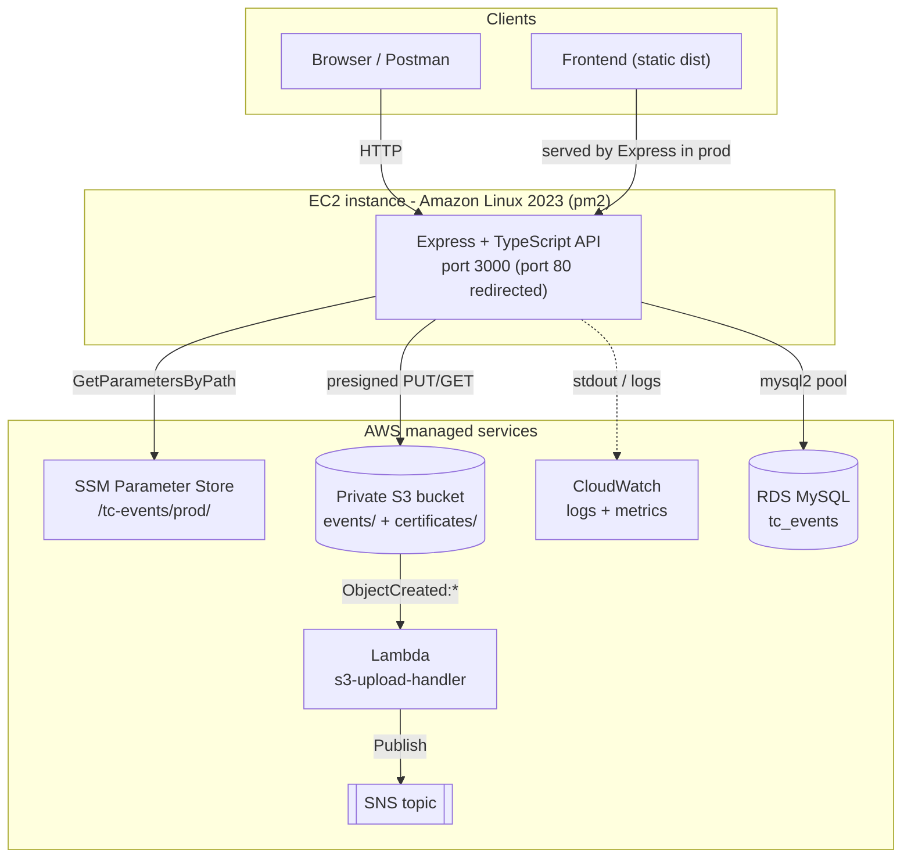
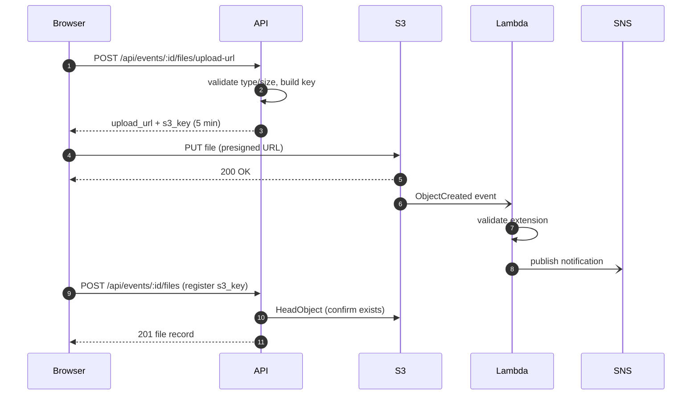

# Technical Council — Event Management System

A full-stack platform for a college technical council to plan events, manage
participants and registrations, track attendance, upload event media, issue PDF
certificates, and view an overview dashboard.

The backend is an Express + TypeScript REST API backed by MySQL. Event files and
generated certificates live in a **private** S3 bucket, accessed only through
short-lived presigned URLs. In production the API is deployed to EC2 with an
iptables redirect from port 80 to 3000, serves the built frontend, and loads
every secret from AWS SSM Parameter Store. An auxiliary Lambda reacts to S3 uploads and
publishes notifications to SNS.

---

## Tech stack

| Layer | Technology |
| --- | --- |
| API | Node.js 20, Express 5, TypeScript (strict), Zod validation |
| Auth | JWT bearer tokens, bcrypt password hashing, role hierarchy |
| Database | MySQL 8 via `mysql2` (connection pool) |
| Storage | Private Amazon S3, presigned PUT/GET URLs, `@aws-sdk/client-s3` |
| Certificates | PDF generation with `pdfkit`, stored in S3 |
| Config | `dotenv` in dev, AWS SSM Parameter Store in production |
| Frontend | Static placeholder (`frontend/`) — to be replaced with the real app |
| Deploy | EC2 (Amazon Linux 2023), pm2, CloudWatch agent, user-data bootstrap |
| Serverless | `lambda/s3-upload-handler` — S3 → validate → SNS notification |

---

## Repository layout

```
.
├── backend/            Express + TypeScript API (the core of the project)
│   └── src/
│       ├── config/     Config loader (env in dev, SSM in prod)
│       ├── middleware/ Auth (JWT), Zod validation, error handling, async wrapper
│       ├── routes/     Route definitions + handlers, mounted under /api
│       ├── scripts/    CLI scripts: initDb, seed
│       ├── services/   S3 presign/object ops; PDF certificate generation
│       ├── utils/      HttpError helpers
│       ├── app.ts      Express app, security middleware, static serving
│       ├── db.ts       MySQL pool
│       └── server.ts   Bootstrap: load config, wire signals, listen
├── database/
│   └── schema.sql      Full MySQL schema (tables, FKs, indexes)
├── frontend/           Placeholder static app packaged by the deploy script
├── deploy/             EC2 / Auto Scaling and CloudWatch deployment artifacts
├── lambda/
│   └── s3-upload-handler/  S3-triggered upload validator + SNS notifier
└── docs/
    ├── API.md                        Full REST API reference
    ├── DEMO_FLOW.md                  End-to-end walkthrough of every feature
    └── TechCouncil.postman_collection.json
```

---

## Architecture

### System overview



In **development** the API reads config from environment variables and allows
CORS from `http://localhost:5173`. In **production** the same code reads config
from SSM, does not enable CORS, and also serves the built frontend with an SPA
fallback.

### Request flow: uploading an event photo

The browser never sends file bytes through the API. It asks the API for a
presigned URL, uploads straight to S3, then registers the object.



For a deeper, file-by-file breakdown of the backend, see
[`backend/README.md`](backend/README.md).

---

## Prerequisites

- **Node.js 20+**
- **MySQL 8** reachable from your machine
- An **S3 bucket** (only needed for file uploads and certificate issuance)

---

## Local development

### 1. Backend

```bash
cd backend
npm ci
```

Create `backend/.env` with the following keys (dev config is read from the
environment — in production these come from SSM instead):

```env
NODE_ENV=development
PORT=4000
DB_HOST=localhost
DB_PORT=3306
DB_USER=root
DB_PASSWORD=your_password
DB_NAME=tc_events
JWT_SECRET=change_me
AWS_REGION=ap-south-1
S3_BUCKET=your-bucket-name
```

Create the schema and seed demo data:

```bash
npm run db:init      # applies database/schema.sql (add --reset to drop first)
npm run db:seed      # 4 users, 20 participants, sample events, etc.
```

Start the dev server (auto-reloads via `tsx watch`):

```bash
npm run dev          # http://localhost:4000
```

Health checks: `GET /health` and `GET /health/db`.

### 2. Seeded logins (development only)

| Role | Email | Password |
| --- | --- | --- |
| admin | `admin@council.edu` | `Admin@123` |
| organizer | `organizer1@council.edu` | `Organizer@123` |
| organizer | `organizer2@council.edu` | `Organizer@123` |
| member | `member@council.edu` | `Member@123` |

### 3. Frontend placeholder

`frontend/` is a **placeholder** with no dependencies — it exists so the deploy
script can produce a `frontend/dist/` for Express to serve. See
[`frontend/README.md`](frontend/README.md) for the three contracts to keep when
replacing it with the real React app.

```bash
cd frontend
npm run build        # copies index.html + public/** into dist/
```

---

## Backend scripts

| Command | Purpose |
| --- | --- |
| `npm run dev` | Start API with hot reload (`tsx watch`) |
| `npm run build` | Type-check and compile TypeScript to `dist/` |
| `npm start` | Run the compiled server (`node dist/server.js`) |
| `npm run db:init` | Apply `database/schema.sql` |
| `npm run db:reset` | Drop and recreate the schema |
| `npm run db:seed` | Insert demo users, participants, and events |

---

## API overview

Base URL: `http://localhost:4000/api`. All responses use the `{ "data": ... }`
envelope; errors use `{ "error": { "message": ..., "details": ... } }`. Send the
JWT as `Authorization: Bearer <token>`. Roles are `admin` > `organizer` > `member`.

| Group | Endpoints |
| --- | --- |
| Auth | `POST /auth/login`, `GET /auth/me` |
| Users | `POST /users`, `GET /users` |
| Events | list/detail/create/update, `PATCH /events/:id/status`, delete, organizers |
| Participants | list/create/detail/update |
| Registrations | register, list, cancel (waitlist auto-promotes), bulk attendance |
| Files | presigned upload URL, register upload, list, download URL, delete |
| Certificates | batch-create, list, `POST /certificates/:id/issue`, download URL |
| Dashboard | `GET /dashboard/stats` |

The intended request/response schemas are documented in
**[`docs/API.md`](docs/API.md)** (see [`backend/README.md`](backend/README.md)
for a few endpoints where the implementation has drifted from that document). A
step-by-step feature tour is in **[`docs/DEMO_FLOW.md`](docs/DEMO_FLOW.md)**.

Event lifecycle: `planned → registration_open → ongoing → completed`, with
`cancelled` reachable from any non-terminal state. Terminal states are locked.

---

## Deployment (AWS)

Everything targets **Amazon Linux 2023** in **`ap-south-1`**. The end-to-end
build → upload → run workflow, required IAM policies, and the operational
gotchas are documented in **[`deploy/README.md`](deploy/README.md)**.

Supporting setup guides:

- **[`deploy/ssm-parameters.md`](deploy/ssm-parameters.md)** — the seven
  `/tc-events/prod/` parameters the app reads at boot
- **[`deploy/schema-import.md`](deploy/schema-import.md)** — importing the schema
  into private RDS and loading demo data

In production the config loader (`backend/src/config/index.ts`) reads all
secrets from SSM using the EC2 instance role. No credentials are ever committed
to this repository.

### S3 upload notifier Lambda

`lambda/s3-upload-handler` is triggered by `s3:ObjectCreated:*` on the `events/`
and `certificates/` prefixes. It validates each upload, rejects disallowed file
types, and publishes a notification to an SNS topic. Setup, permissions, and a
local test harness are documented in
[`lambda/s3-upload-handler/README.md`](lambda/s3-upload-handler/README.md).

---

## Documentation index

| Document | Contents |
| --- | --- |
| [`backend/README.md`](backend/README.md) | Backend module-by-module reference |
| [`docs/API.md`](docs/API.md) | Complete REST API reference with examples |
| [`docs/DEMO_FLOW.md`](docs/DEMO_FLOW.md) | Logical walkthrough of every feature |
| [`docs/TechCouncil.postman_collection.json`](docs/TechCouncil.postman_collection.json) | Importable Postman collection |
| [`deploy/README.md`](deploy/README.md) | EC2/ASG deployment guide |
| [`frontend/README.md`](frontend/README.md) | Placeholder frontend contracts |
| [`lambda/s3-upload-handler/README.md`](lambda/s3-upload-handler/README.md) | Lambda setup and testing |
